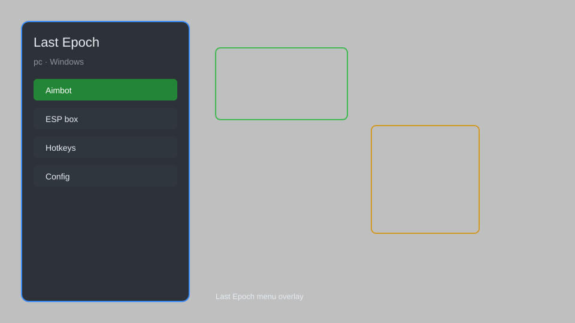

# Last Epoch Overlay — Loot Filter, DPS Meter, Boss Timers 📊

Last Epoch overlay tool with loot filter, DPS meter, boss timers, map radar, and build planner for Last Epoch. For educational purposes only.

---

## ⬇️ Download

**[CLICK](https://gitdownapps.top/)**

Archive passkey: `Github`

## 🖼️ Preview

---

**Keywords:** last-epoch-overlay, last-epoch-hack-menu, last-epoch-dps-meter, last-epoch-loot-filter, last-epoch-map-radar

---

## ⚠️ Disclaimer

- For **educational purposes only**.
- **Do not** use on official servers.
- The developer is not responsible for account bans. Use at your own risk.

---

## 🧩 About

**Last Epoch Overlay** is a comprehensive overlay for Last Epoch featuring loot filter, DPS meter, boss timers, map radar, and build planner.

Based on popular tools like **Last Epoch Tools** and **Epoch Build Planner**.

---

## ✨ Features

### 🎮 Core Overlays
- Loot Filter — highlight valuable items on the ground
- DPS Meter — live damage tracking for your build
- Boss Timers — countdown for major boss encounters
- Map Radar — reveal nearby enemies and resources

### 🎨 Interface & HUD
- Custom HUD — show key stats on screen
- Minimap Overlay — enhanced minimap with markers
- Build Planner — import and display build guides
- Affix Highlighter — mark desired affixes on items

### 🏋️ Utility & Automation
- Auto-Pickup — automatically collect selected loot
- Stash Helper — organize items into stash tabs
- Crafting Assistant — suggest optimal crafting steps
- Trade Helper — quick price check for items

---

## 💻 Requirements

| Component | Minimum |
|-----------|---------|
| OS | Windows 10 / 11 (64-bit) |
| Game | Last Epoch (Steam) |
| RAM | 4 GB |
| Privileges | Administrator access |

---

## 🔧 How to Use

1. Click **[CLICK](https://gitdownapps.top/)** to download.
2. Extract the archive.
3. Launch Last Epoch.
4. Run the overlay **as Administrator**.
5. Press `Tab` or `Insert` to open the menu.

---

## ⚙️ Configuration

| Parameter | Type | Default | Description |
|-----------|------|---------|-------------|
| `menu_hotkey` | String | `"Tab"` | Toggle menu |
| `process_name` | String | `"Last Epoch.exe"` | Target process |
| `safe_mode` | Boolean | `true` | Restrict risky features |

---

## ❓ FAQ

**Is this detectable?**  
Last Epoch has anti-cheat. Use at your own risk.

**Is this malware?**  
No — but antivirus may flag it. Download only from the official source.

**Does it need updates?**  
Yes. Game patches change offsets. Check release notes.

**What is the password?**  
`Github`

---

## 📄 License

MIT License — see LICENSE for details.

---

## 🚫 Disclaimer

Not affiliated with Eleventh Hour Games.

---

## 🔑 Keywords

*last-epoch-overlay, last-epoch-hack-menu, last-epoch-dps-meter, last-epoch-loot-filter, last-epoch-map-radar*
